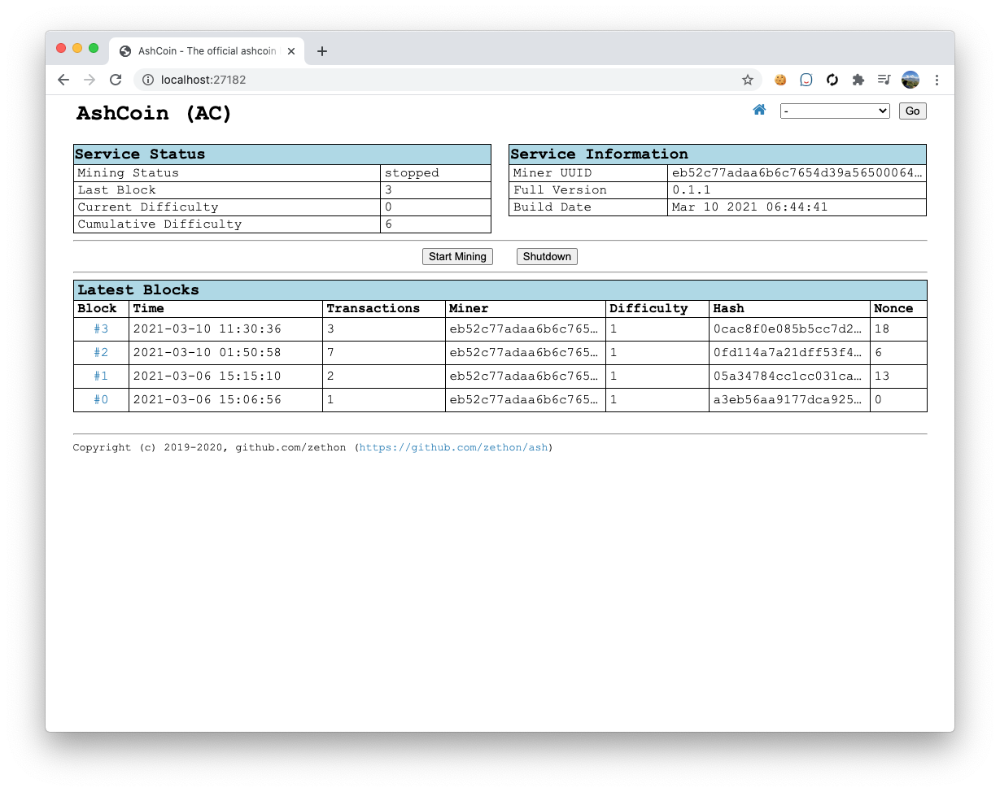
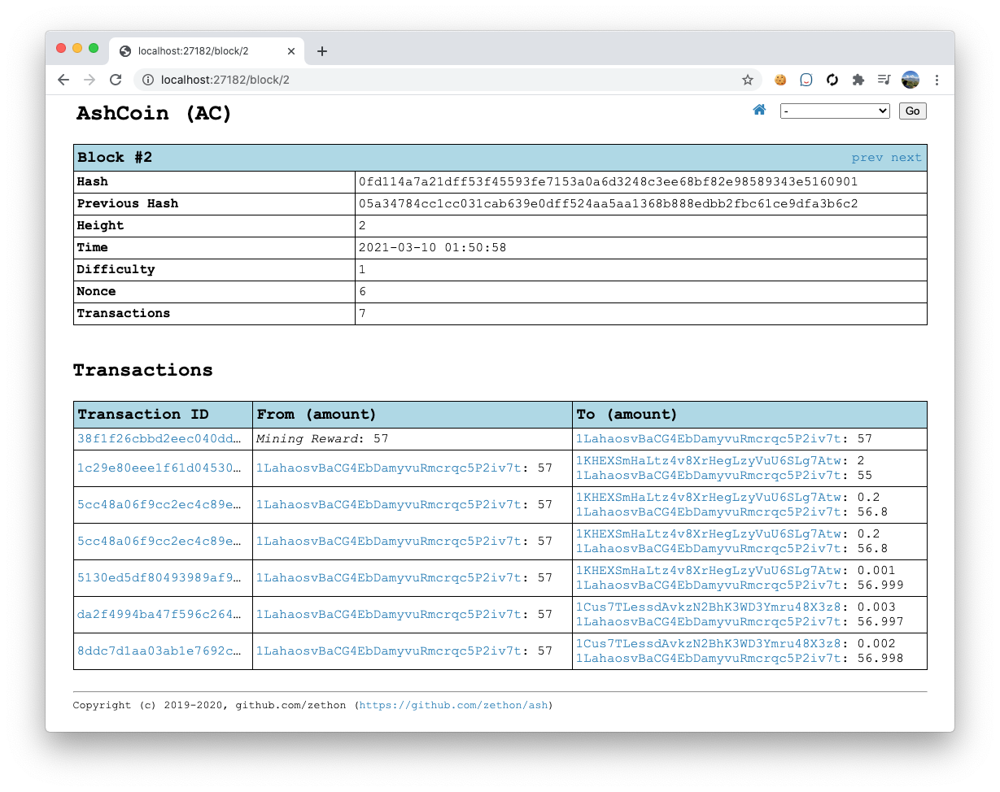
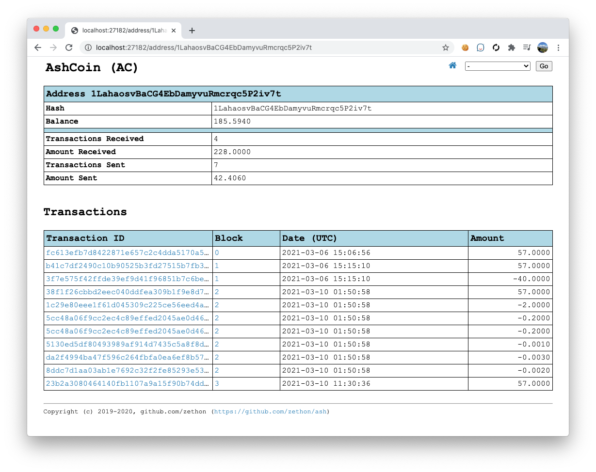

# Ash


Ash is a crypto-currency built from scratch.

The goals with this project are:

* **Mining**: A single chain is synced across a peer-to-peer network based on cumulative difficulty
* **Networking**: Miners can join/leave the mining network without any configuration on a central node.
* **Wallets**: Users can send coins from one wallet to another.
* **Security**: The network should be smart enough to reject basic attempts at forging chains and transactions.


A lot of this project is based on [this Javascript tutorial](https://lhartikk.github.io/jekyll/update/2017/07/15/chapter0.html). However this project uses C++ (as of this writing I am using C++17, but hope to switch to C++20 soon). 

**NOTE**: This is **a fun project**. I am writing this to learn about blockchains and crypto currency. **I am not an expert**. This is not intended to be a real crypto currency.

## Todo

These are the next priorities I am working on with some explanation of what I intend to do. Any help is more than welcome!

* Get rid of the proprietary database - For some reason I decided to go with a proprietary database for storing the chain. This should be refactored to use something else like Google's LevelDB (which is what Bitcoin uses)
* Get rid of the text hashes and ids - The hash values for blocks and ids for transactions use strings produced from SHA256 values. Instead we should be using `CryptoPP::Integer` and do the string conversation where and when neeed.
* Refactor difficulty - Currently difficulty is based on the number of leading zeros in the string value of the hash of the block. This should use a method more widely used in crypto, such as finding a hash integer value that's less than a given value.

## Building

The following tools are required on all platforms:

* CMake version 3.19
* conan version 1.32.1

All platforms require a C++17 compiler, CMake and conan. The following conan repository must be added to your local cache:

```shell
conan remote add owl https://api.bintray.com/conan/zethon/owl
```

### Windows

This project has been compiled on Windows 10 using Visual Studio 2019. Because of [an issue](https://github.com/microsoft/vcpkg/issues/15035) with range-v3, Windows SDK 10.0.18362.0 is required and can be downloaded [here](https://developer.microsoft.com/en-us/windows/downloads/windows-10-sdk/).

To create a `.sln` file, run the following commands from the root source directory.

```shell
mkdir build
cd build
conan install .. -s build_type=Debug --build missing
cmake .. -DCMAKE_BUILD_TYPE=Debug -DBUILD_ASH_TESTS=On
```

### macos

This project has been compiled on macos 10.15 using Apple clang 11.0. I have been using Visual Studio Code as my IDE. To create the necessary files run the following commands from the src folder:

```shell
mkdir build
cd build
conan install .. -s build_type=Debug --build missing
cmake .. "-GNinja" -DCMAKE_BUILD_TYPE=Debug -DBUILD_ASH_TESTS=On
```

If there are no errors then the executable can be built with:

```shell
cmake --build . -- -j 8
```

### Ubuntu

## Documentation

### [Settings File](docs/settings.md)
Documentation about configuring Ash.

### [Bookmarks](docs/bookmarks.md)
A list of relevant links used while developing Ash.

### [Testing Doc](docs/testing.md)
Testing plans for Ash

## Screenshots

### Index


### View Block


### View Address

